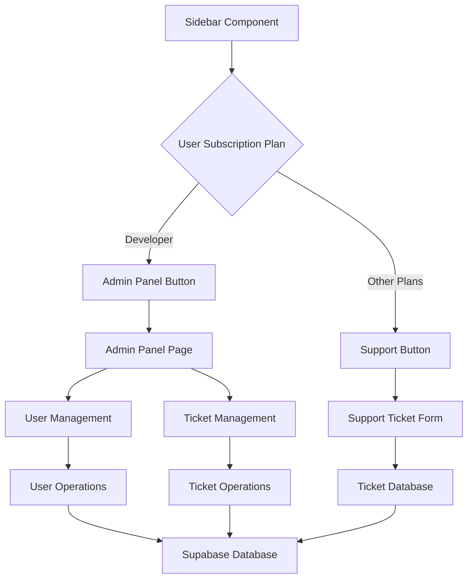
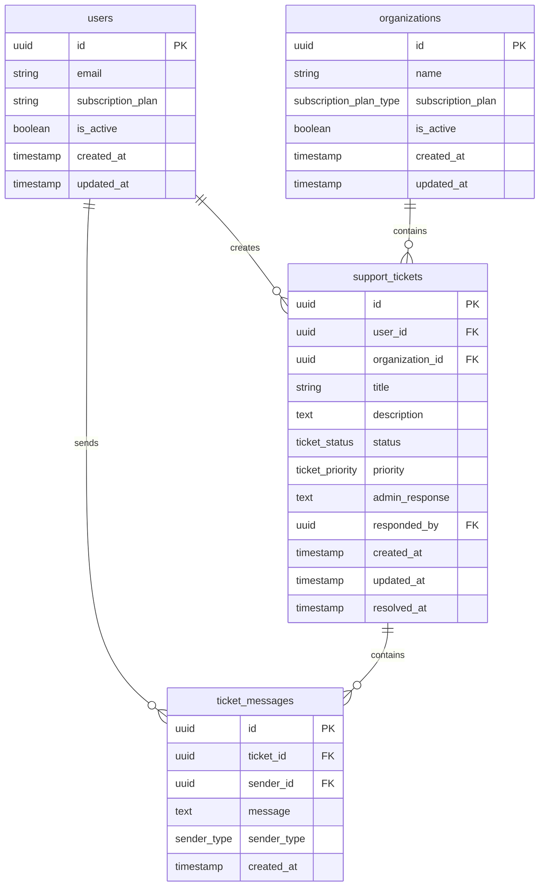
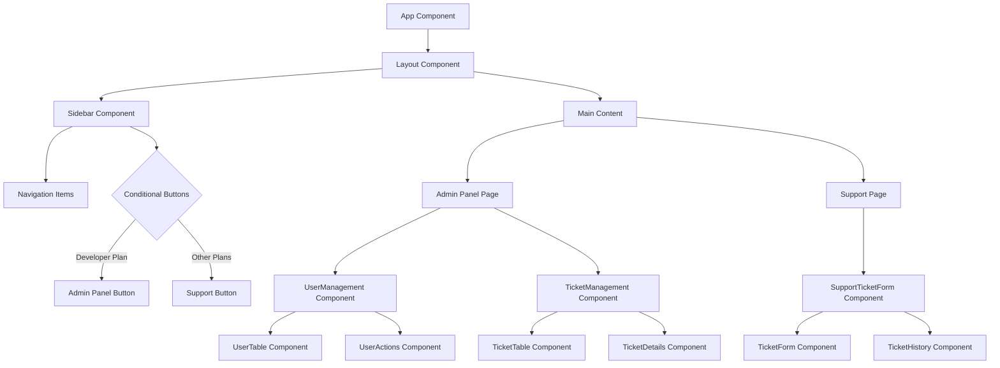

# Admin Panel and Support Ticket System Design

## Overview

This design document outlines the implementation of a comprehensive admin panel and support ticket system for FlowNest application. The system provides role-based access control where users with "Developer" subscription plans get access to an admin panel, while other users (starter, professional, enterprise) get access to a support ticket system.

## Architecture

### Component Architecture



### Database Schema



## Frontend Architecture

### Component Hierarchy



### State Management

- **Organization Context**: Current user's organization and subscription plan
- **Admin Context**: Admin-specific state for user and ticket management
- **Support Context**: Support ticket state and form data
- **User Authentication**: Current user session and permissions

## API Endpoints Reference

### User Management API

| Endpoint | Method | Description | Access Level |
|----------|--------|-------------|--------------|
| `/api/admin/users` | GET | List all users | Developer only |
| `/api/admin/users/{id}` | PUT | Update user | Developer only |
| `/api/admin/users/{id}/block` | POST | Block/unblock user | Developer only |
| `/api/admin/users/{id}/plan` | PUT | Change subscription plan | Developer only |

### Support Ticket API

| Endpoint | Method | Description | Access Level |
|----------|--------|-------------|--------------|
| `/api/tickets` | GET | Get user's tickets | Authenticated users |
| `/api/tickets` | POST | Create new ticket | Authenticated users |
| `/api/tickets/{id}` | GET | Get ticket details | Ticket owner or admin |
| `/api/tickets/{id}/respond` | POST | Respond to ticket | Developer only |
| `/api/admin/tickets` | GET | Get all tickets | Developer only |

## Data Models & Database Implementation

### Support Tickets Table

```sql
-- Create enum types
CREATE TYPE ticket_status AS ENUM ('open', 'in_progress', 'resolved', 'closed');
CREATE TYPE ticket_priority AS ENUM ('low', 'medium', 'high', 'urgent');
CREATE TYPE sender_type AS ENUM ('user', 'admin');

-- Support tickets table
CREATE TABLE support_tickets (
    id UUID DEFAULT gen_random_uuid() PRIMARY KEY,
    user_id UUID REFERENCES auth.users(id) ON DELETE CASCADE,
    organization_id UUID REFERENCES organizations(id) ON DELETE CASCADE,
    title TEXT NOT NULL,
    description TEXT NOT NULL,
    status ticket_status DEFAULT 'open',
    priority ticket_priority DEFAULT 'medium',
    admin_response TEXT,
    responded_by UUID REFERENCES auth.users(id),
    created_at TIMESTAMP WITH TIME ZONE DEFAULT NOW(),
    updated_at TIMESTAMP WITH TIME ZONE DEFAULT NOW(),
    resolved_at TIMESTAMP WITH TIME ZONE
);

-- Ticket messages table for conversation
CREATE TABLE ticket_messages (
    id UUID DEFAULT gen_random_uuid() PRIMARY KEY,
    ticket_id UUID REFERENCES support_tickets(id) ON DELETE CASCADE,
    sender_id UUID REFERENCES auth.users(id) ON DELETE CASCADE,
    message TEXT NOT NULL,
    sender_type sender_type NOT NULL,
    created_at TIMESTAMP WITH TIME ZONE DEFAULT NOW()
);

-- RLS Policies
ALTER TABLE support_tickets ENABLE ROW LEVEL SECURITY;
ALTER TABLE ticket_messages ENABLE ROW LEVEL SECURITY;

-- Users can only see their own tickets
CREATE POLICY "Users can view own tickets" ON support_tickets
    FOR SELECT USING (user_id = auth.uid());

-- Users can create tickets
CREATE POLICY "Users can create tickets" ON support_tickets
    FOR INSERT WITH CHECK (user_id = auth.uid());

-- Developer plan users can see all tickets (admin access)
CREATE POLICY "Developers can view all tickets" ON support_tickets
    FOR ALL USING (
        EXISTS (
            SELECT 1 FROM user_organizations uo
            JOIN organizations o ON uo.organization_id = o.id
            WHERE uo.user_id = auth.uid() 
            AND o.subscription_plan = 'developer'
        )
    );
```

### Admin User Functions

```sql
-- Function to check if user has developer plan
CREATE OR REPLACE FUNCTION is_developer_user()
RETURNS BOOLEAN AS $$
BEGIN
    RETURN EXISTS (
        SELECT 1 FROM user_organizations uo
        JOIN organizations o ON uo.organization_id = o.id
        WHERE uo.user_id = auth.uid() 
        AND o.subscription_plan = 'developer'
    );
END;
$$ LANGUAGE plpgsql SECURITY DEFINER;

-- Function to get user's subscription plan
CREATE OR REPLACE FUNCTION get_user_subscription_plan()
RETURNS TEXT AS $$
DECLARE
    plan TEXT;
BEGIN
    SELECT o.subscription_plan INTO plan
    FROM user_organizations uo
    JOIN organizations o ON uo.organization_id = o.id
    WHERE uo.user_id = auth.uid()
    LIMIT 1;
    
    RETURN COALESCE(plan, 'starter');
END;
$$ LANGUAGE plpgsql SECURITY DEFINER;
```

## Business Logic Layer

### User Management Module

**Features:**
- List all users with pagination
- Search and filter users
- View user details and organization info
- Update user subscription plans
- Block/unblock user accounts
- View user activity logs

**Access Control:**
- Only users with "developer" subscription plan
- Read and write permissions for all user data
- Audit logging for all admin actions

### Support Ticket Module

**For Regular Users:**
- Create new support tickets
- View own ticket history
- Add messages to existing tickets
- Mark tickets as resolved

**For Admin Users (Developer Plan):**
- View all support tickets across organizations
- Respond to tickets
- Change ticket status and priority
- View ticket analytics and reports

## Component Specifications

### Sidebar Component Updates

```typescript
// Additional navigation items based on subscription plan
const getConditionalNavItems = (subscriptionPlan: string) => {
  const items = [];
  
  if (subscriptionPlan === 'developer') {
    items.push({
      name: { tr: 'Admin Panel', en: 'Admin Panel' },
      href: '/admin',
      icon: Shield
    });
  } else {
    items.push({
      name: { tr: 'Destek', en: 'Support' },
      href: '/support',
      icon: HelpCircle
    });
  }
  
  return items;
};
```

### Admin Panel Components

**UserManagement Component:**
- User table with sorting and filtering
- User detail modal
- Bulk operations (block/unblock multiple users)
- Subscription plan change dialog

**TicketManagement Component:**
- Ticket dashboard with statistics
- Ticket list with status filtering
- Ticket detail view with conversation history
- Response form for admin replies

### Support Components

**SupportTicketForm Component:**
- Create new ticket form
- File attachment support
- Priority selection
- Category/tag selection

**TicketHistory Component:**
- List of user's tickets
- Ticket status tracking
- Message history for each ticket

## Integration Patterns

### Supabase Integration

**Real-time Subscriptions:**
- Live updates for new tickets
- Real-time status changes
- Admin notification system

**Database Operations:**
- Use Supabase client for all CRUD operations
- Implement proper error handling
- Use RLS for security

### Authentication Integration

**Role-based Access:**
- Check subscription plan on route access
- Conditional UI rendering based on user role
- Secure API endpoints with proper authorization

## Security Implementation

### Access Control
- Row Level Security (RLS) policies for all tables
- Function-based security for admin operations
- JWT token validation for API access

### Data Protection
- Input validation and sanitization
- SQL injection prevention
- XSS protection for user-generated content

### Audit Logging
- Track all admin actions
- Log ticket status changes
- Monitor user access patterns

## Testing Strategy

### Unit Testing
- Component rendering tests
- Business logic validation
- Database function testing

### Integration Testing
- API endpoint testing
- Database integration tests
- Authentication flow testing

### End-to-End Testing
- User journey testing for ticket creation
- Admin workflow testing
- Role-based access validation