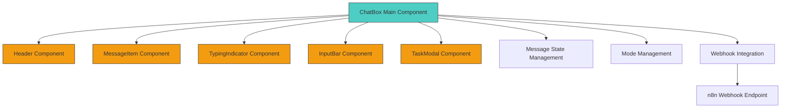
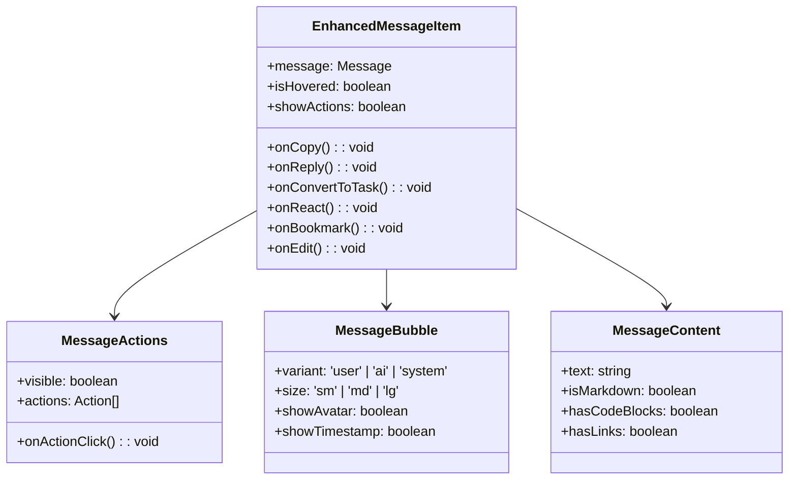
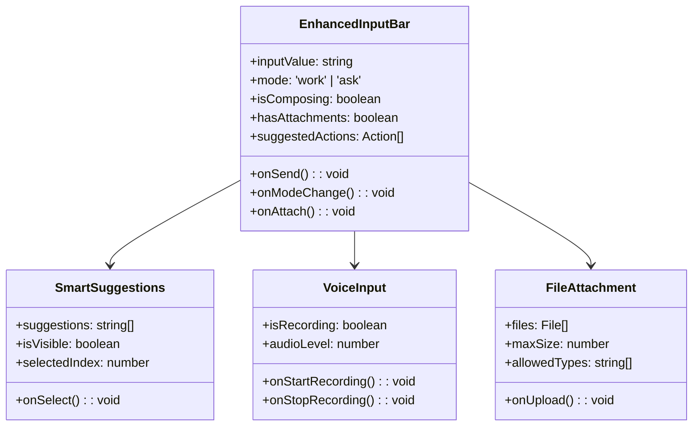
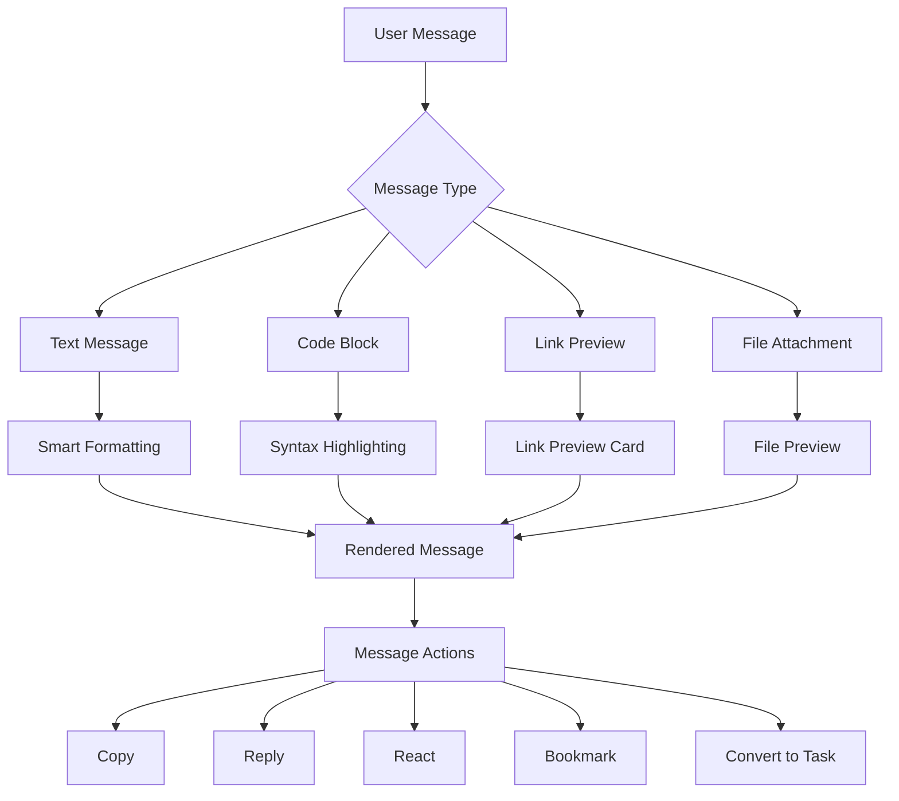
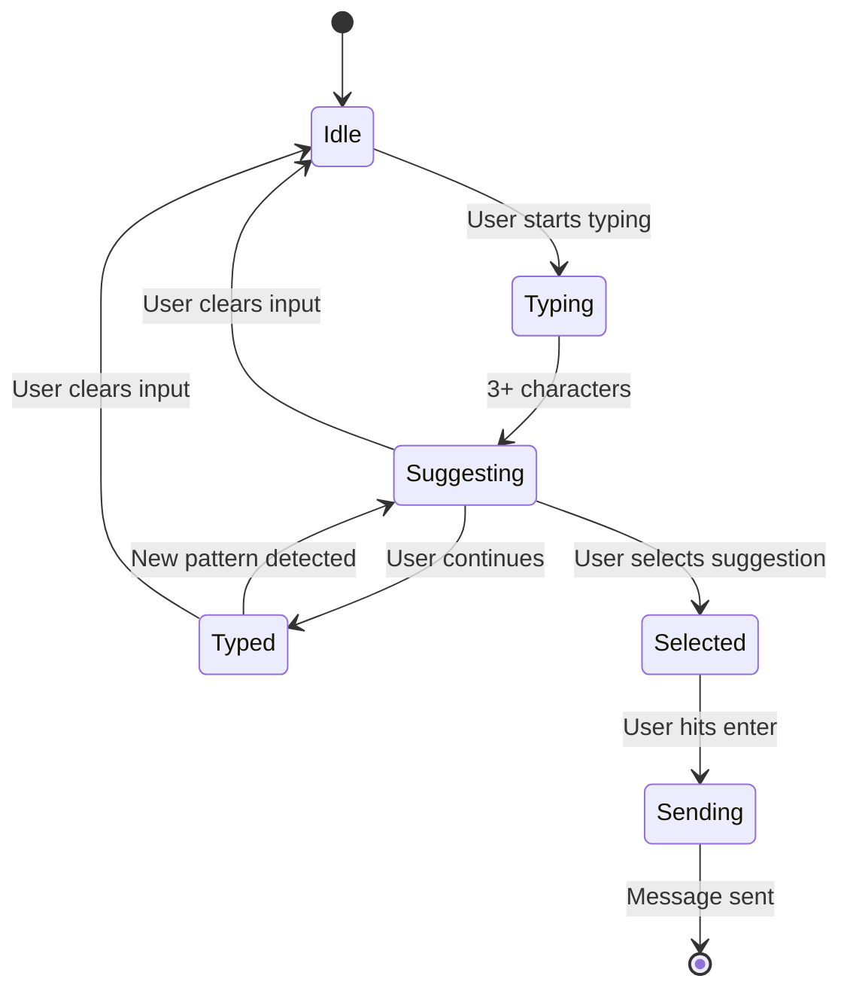
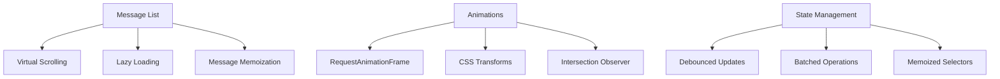
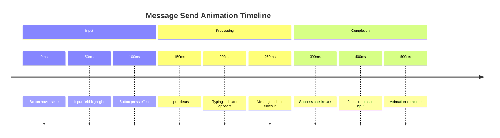

# ChatBot UI Enhancement Design

## Overview

This design document outlines comprehensive UI/UX enhancements for the ChatBox component in the AI Workspace. The current implementation provides basic chat functionality with webhook integration to n8n workflows. The enhancement focuses on improving visual design, user experience, accessibility, and interaction patterns while preserving the existing webhook functionality and API integration.

## Current Implementation Analysis

### Existing Architecture
The current ChatBox component follows a modular architecture with clear separation of concerns:



### Current Features
- Dual mode support (Work/Ask) with visual indicators
- Real-time message exchange via webhook
- Message copying and task conversion
- Typing indicators with animation
- Quick action buttons
- Modal-based task creation
- Responsive design with mobile support

### Current Pain Points
1. **Visual Hierarchy**: Limited contrast and depth in message bubbles
2. **Information Density**: Cluttered interface with multiple UI elements
3. **User Feedback**: Limited visual feedback for user actions
4. **Animation Quality**: Basic animations that could be more polished
5. **Accessibility**: Missing focus states and ARIA labels
6. **Mobile Experience**: Suboptimal touch targets and layout

## Enhanced Design Specifications

### Visual Design System

#### Color Palette Enhancement
```
Primary Colors:
- Deep Blue: #0B1426 (Background)
- Electric Blue: #2563EB (Primary Actions)
- Cyber Green: #10B981 (Success/Work Mode)
- Neon Purple: #8B5CF6 (AI Responses)
- Warm Orange: #F59E0B (Highlights)

Neutral Colors:
- Dark Slate: #1E293B
- Medium Slate: #334155
- Light Slate: #64748B
- Off White: #F8FAFC

Semantic Colors:
- Success: #10B981
- Warning: #F59E0B
- Error: #EF4444
- Info: #3B82F6
```

#### Typography Scale
```
Heading Large: 24px, Weight 700
Heading Medium: 20px, Weight 600
Heading Small: 16px, Weight 600
Body Large: 16px, Weight 400
Body Medium: 14px, Weight 400
Body Small: 12px, Weight 400
Caption: 11px, Weight 500
```

#### Spacing System
```
Space Scale:
- xs: 4px
- sm: 8px
- md: 16px
- lg: 24px
- xl: 32px
- 2xl: 48px
- 3xl: 64px
```

### Component Architecture Enhancements

#### Enhanced Message Component


#### Enhanced Input System


### User Experience Enhancements

#### Interactive States
```
Idle State:
- Subtle breathing animation on send button
- Gentle glow on input field border
- Mode indicators with soft pulse

Active State:
- Input field expands slightly on focus
- Send button transforms with micro-animation
- Real-time character count

Loading State:
- Sophisticated typing indicator with wave pattern
- Progressive dots with elastic animation
- Shimmer effect on message placeholder

Success State:
- Checkmark animation on message sent
- Brief highlight on successful action
- Subtle haptic feedback simulation

Error State:
- Gentle shake animation on failed send
- Red border flash on input field
- Error message with slide-in animation
```

#### Gesture Support
```
Touch Gestures:
- Swipe left on message: Quick reply
- Swipe right on message: Copy/Share options
- Long press on message: Action menu
- Pull down: Refresh conversation
- Two-finger tap: Voice input toggle

Keyboard Shortcuts:
- Ctrl/Cmd + Enter: Send message
- Ctrl/Cmd + K: Clear input
- Ctrl/Cmd + /: Toggle mode
- Arrow Up: Edit last message
- Tab: Navigate between actions
```

### Advanced Features

#### Message Enhancement Features


#### Smart Input Suggestions


### Accessibility Enhancements

#### ARIA Implementation
```
Message Container:
- role="log"
- aria-live="polite"
- aria-label="Chat conversation"

Message Items:
- role="article"
- aria-labelledby="message-{id}-author"
- aria-describedby="message-{id}-content"

Input Field:
- aria-label="Type your message"
- aria-describedby="mode-indicator character-count"
- aria-expanded for suggestions

Action Buttons:
- Descriptive aria-labels
- aria-pressed for toggles
- aria-disabled for unavailable actions
```

#### Keyboard Navigation
```
Tab Order:
1. Mode selector buttons
2. Input field
3. Send button
4. Message actions (when focused)
5. Quick action buttons

Focus Management:
- Focus trap in modal dialogs
- Return focus to trigger element
- Skip links for long message lists
- Focus indicators with 2px outline
```

### Performance Optimizations

#### Rendering Optimizations


#### Memory Management
```
Optimization Strategies:
- Virtualized message list for long conversations
- Image lazy loading with intersection observer
- Debounced scroll handlers (100ms)
- Memoized message components
- Cleanup of event listeners and timers
- Efficient re-render prevention
```

### Component Implementation Structure

#### File Organization
```
ChatBox/
├── index.tsx                 // Main ChatBox component
├── components/
│   ├── MessageItem/
│   │   ├── index.tsx
│   │   ├── MessageBubble.tsx
│   │   ├── MessageActions.tsx
│   │   └── MessageContent.tsx
│   ├── InputBar/
│   │   ├── index.tsx
│   │   ├── InputField.tsx
│   │   ├── ModeSelector.tsx
│   │   ├── AttachmentButton.tsx
│   │   └── VoiceButton.tsx
│   ├── TypingIndicator/
│   │   └── index.tsx
│   └── Suggestions/
│       └── index.tsx
├── hooks/
│   ├── useMessageList.ts
│   ├── useVoiceInput.ts
│   ├── useSuggestions.ts
│   └── useKeyboardShortcuts.ts
├── utils/
│   ├── messageFormatters.ts
│   ├── animationHelpers.ts
│   └── accessibilityUtils.ts
└── types/
    ├── message.types.ts
    ├── input.types.ts
    └── animation.types.ts
```

#### Enhanced Props Interface
```typescript
interface EnhancedChatBoxProps {
  // Existing props preserved
  onModeChange?: (mode: 'work' | 'ask') => void;
  
  // New enhancement props
  theme?: 'dark' | 'light' | 'auto';
  maxMessages?: number;
  enableVoiceInput?: boolean;
  enableFileUpload?: boolean;
  enableMarkdown?: boolean;
  enableSuggestions?: boolean;
  autoFocus?: boolean;
  placeholder?: string;
  
  // Animation preferences
  reducedMotion?: boolean;
  animationDuration?: number;
  
  // Accessibility
  screenReaderOptimized?: boolean;
  highContrast?: boolean;
  
  // Webhook configuration (preserved)
  webhookUrl?: string;
  webhookHeaders?: Record<string, string>;
  
  // Event handlers
  onMessageSent?: (message: Message) => void;
  onError?: (error: Error) => void;
  onTypingStart?: () => void;
  onTypingEnd?: () => void;
}
```

### Animation System

#### Micro-Interactions


#### Transition Specifications
```
Message Entrance:
- Transform: translateY(20px) → translateY(0)
- Opacity: 0 → 1
- Duration: 300ms
- Easing: cubic-bezier(0.4, 0, 0.2, 1)

Button Interactions:
- Scale: 1 → 1.05 → 1
- Duration: 150ms
- Easing: cubic-bezier(0.34, 1.56, 0.64, 1)

Mode Switch:
- Background: smooth color transition
- Duration: 200ms
- Easing: ease-in-out

Typing Indicator:
- Dots: staggered bounce animation
- Duration: 1.2s infinite
- Easing: ease-in-out
```

### Testing Strategy

#### Component Testing
```
Unit Tests:
- Message rendering with different types
- Input validation and sanitization
- Mode switching functionality
- Webhook integration (mocked)
- Accessibility compliance
- Error handling scenarios

Integration Tests:
- End-to-end message flow
- Voice input integration
- File upload workflow
- Keyboard navigation
- Screen reader compatibility

Performance Tests:
- Large message list rendering
- Animation frame rate monitoring
- Memory leak detection
- Bundle size analysis
```

#### Testing Tools
```
Testing Framework:
- Jest for unit tests
- React Testing Library for component tests
- Cypress for E2E tests
- axe-core for accessibility testing
- Lighthouse for performance auditing
```