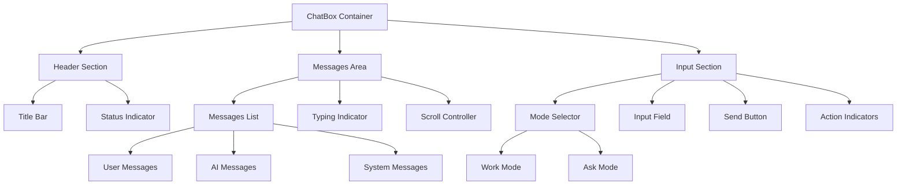

# ChatBox UI Redesign - Modern Professional Interface

## Overview

This document outlines the redesign of the ChatBox component in the FlowNest AI Workspace to achieve a modern, professional appearance with sharp lines and bold aesthetics. The new design transforms the current soft, rounded interface into a crisp, enterprise-grade chatbot interface similar to professional AI platforms like ChatGPT Plus, Claude Pro, and modern business communication tools.

### Design Goals
- Replace soft, rounded elements with sharp, angular design
- Implement bold, high-contrast visual hierarchy
- Create a professional, enterprise-grade appearance
- Maintain excellent readability and usability
- Ensure responsive behavior across devices
- Preserve existing functionality while enhancing visual appeal

## Technology Stack & Dependencies

The redesign leverages the existing technology stack:
- **React 18.3.1** with TypeScript for component logic
- **Framer Motion** for enhanced animations and transitions
- **Tailwind CSS 3.4.1** for utility-first styling
- **Lucide React** for consistent iconography
- **shadcn/ui** design system compatibility

## Component Architecture

### Current Component Structure
```
ChatBox Component
├── Header Section
├── Messages Container
│   ├── Message Bubbles (User/AI)
│   ├── Typing Indicator
│   └── Auto-scroll Reference
└── Input Area
    ├── Mode Toggle Buttons
    └── Message Input with Send Button
```

### Enhanced Architecture


## Visual Design System

### Color Palette
The new design implements a high-contrast, professional color scheme:

```css
/* Primary Colors */
--chat-background: #0a0a0b;        /* Deep black background */
--chat-surface: #1a1a1b;          /* Secondary surface */
--chat-border: #2d2d30;           /* Sharp borders */
--chat-accent: #0084ff;           /* Primary blue accent */
--chat-accent-hover: #0066cc;     /* Hover state */

/* Message Colors */
--user-work-bg: #00d4aa;          /* Work mode - teal */
--user-ask-bg: #8b5cf6;           /* Ask mode - purple */
--ai-message-bg: #2d2d30;         /* AI message background */
--system-message-bg: #1a1a1b;     /* System message background */

/* Text Colors */
--text-primary: #ffffff;          /* Primary text */
--text-secondary: #b3b3b3;        /* Secondary text */
--text-muted: #666666;            /* Muted text */
--text-accent: #0084ff;           /* Accent text */

/* Status Colors */
--status-online: #00d26a;         /* Online indicator */
--status-typing: #ffa500;         /* Typing indicator */
--status-error: #ff4757;          /* Error state */
```

### Typography System
```css
/* Typography Scale */
--font-title: 18px;               /* Component title */
--font-subtitle: 14px;            /* Subtitle/description */
--font-message: 15px;             /* Message text */
--font-input: 14px;               /* Input text */
--font-button: 13px;              /* Button text */

/* Font Weights */
--weight-bold: 700;               /* Titles and emphasis */
--weight-medium: 500;             /* Buttons and labels */
--weight-normal: 400;             /* Body text */
```

### Geometric Design Elements
- **Border Radius**: 0px to 4px maximum (sharp corners)
- **Border Width**: 1px standard, 2px for emphasis
- **Shadow System**: Crisp, defined shadows with minimal blur
- **Grid System**: 8px base unit for consistent spacing

## Interface Layout Specifications

### Header Section Design
```
┌─────────────────────────────────────────┐
│ ● AI Assistant                    [●]   │ ← Status bar with indicators
├─────────────────────────────────────────┤
│ Integrated Research Interface           │ ← Subtitle
└─────────────────────────────────────────┘
```

**Design Features:**
- Rectangle header with sharp edges
- Bold typography hierarchy
- Status indicators with geometric shapes
- Minimal padding for compact appearance

### Message Container Design
```
┌─────────────────────────────────────────┐
│                                         │
│  ┌────────────────────┐                 │ ← AI Message (left-aligned)
│  │ AI Response here   │                 │
│  └────────────────────┘                 │
│                                         │
│                 ┌────────────────────┐  │ ← User Message (right-aligned)
│                 │ User input here    │  │
│                 └────────────────────┘  │
│                                         │
└─────────────────────────────────────────┘
```

**Design Features:**
- Sharp rectangular message bubbles
- Clear left/right alignment
- High contrast between message types
- Minimal rounded corners (2px maximum)

### Input Area Design
```
┌─────────────────────────────────────────┐
│ [WORK] [ASK]                           │ ← Mode toggle buttons
├─────────────────────────────────────────┤
│ [Input field.....................] [>] │ ← Input with send button
└─────────────────────────────────────────┘
```

**Design Features:**
- Rectangular toggle buttons with sharp edges
- Bold mode indicators
- Minimal input field styling
- Geometric send button icon

## Component Styling Specifications

### Container Styling
```css
.chatbox-container {
  background: linear-gradient(135deg, #0a0a0b 0%, #1a1a1b 100%);
  border: 2px solid #2d2d30;
  border-radius: 0px;
  box-shadow: 0 8px 32px rgba(0, 0, 0, 0.5);
  backdrop-filter: blur(20px);
}
```

### Message Bubble Styling
```css
/* User Messages */
.message-user-work {
  background: linear-gradient(135deg, #00d4aa 0%, #00bfa5 100%);
  border: 1px solid #00bfa5;
  border-radius: 2px;
  color: #000000;
  font-weight: 500;
}

.message-user-ask {
  background: linear-gradient(135deg, #8b5cf6 0%, #7c3aed 100%);
  border: 1px solid #7c3aed;
  border-radius: 2px;
  color: #ffffff;
  font-weight: 500;
}

/* AI Messages */
.message-ai {
  background: #2d2d30;
  border: 1px solid #404040;
  border-radius: 2px;
  color: #ffffff;
  border-left: 3px solid #0084ff;
}
```

### Button Styling
```css
.mode-button {
  background: #2d2d30;
  border: 1px solid #404040;
  border-radius: 0px;
  color: #b3b3b3;
  font-weight: 600;
  text-transform: uppercase;
  letter-spacing: 0.5px;
  transition: all 0.2s ease;
}

.mode-button.active.work {
  background: linear-gradient(135deg, #00d4aa 0%, #00bfa5 100%);
  border: 1px solid #00bfa5;
  color: #000000;
  box-shadow: 0 0 10px rgba(0, 212, 170, 0.3);
}

.mode-button.active.ask {
  background: linear-gradient(135deg, #8b5cf6 0%, #7c3aed 100%);
  border: 1px solid #7c3aed;
  color: #ffffff;
  box-shadow: 0 0 10px rgba(139, 92, 246, 0.3);
}
```

## Animation System

### Enhanced Micro-interactions
```javascript
// Message entrance animation
const messageVariants = {
  hidden: { 
    opacity: 0, 
    y: 20, 
    scale: 0.95,
    filter: "blur(4px)"
  },
  visible: { 
    opacity: 1, 
    y: 0, 
    scale: 1,
    filter: "blur(0px)",
    transition: {
      type: "spring",
      stiffness: 300,
      damping: 20
    }
  }
};

// Button hover animations
const buttonVariants = {
  hover: { 
    scale: 1.02,
    boxShadow: "0 4px 12px rgba(0, 132, 255, 0.2)",
    transition: { duration: 0.15 }
  },
  tap: { 
    scale: 0.98,
    transition: { duration: 0.1 }
  }
};
```

### Typing Indicator Animation
```javascript
const typingIndicator = {
  animate: {
    opacity: [0.4, 1, 0.4],
    scale: [0.95, 1, 0.95],
    transition: {
      duration: 1.5,
      repeat: Infinity,
      ease: "easeInOut"
    }
  }
};
```

## Responsive Design Strategy

### Breakpoint System
```css
/* Mobile First Approach */
.chatbox-responsive {
  /* Mobile (320px - 768px) */
  width: 100%;
  height: 60vh;
  margin: 8px;
  
  /* Tablet (768px - 1024px) */
  @media (min-width: 768px) {
    width: 90%;
    height: 70vh;
    margin: 16px;
  }
  
  /* Desktop (1024px+) */
  @media (min-width: 1024px) {
    width: 400px;
    height: 600px;
    margin: 24px;
  }
}
```

### Mobile Optimizations
- Touch-friendly button sizes (minimum 44px)
- Simplified message bubbles for narrow screens
- Collapsible mode selector on small devices
- Optimized keyboard interaction

## Accessibility Enhancements

### ARIA Implementation
```html
<div role="chatbox" aria-label="AI Assistant Chat Interface">
  <div role="log" aria-live="polite" aria-label="Chat messages">
    <!-- Messages container -->
  </div>
  <div role="form" aria-label="Message input">
    <!-- Input area -->
  </div>
</div>
```

### Keyboard Navigation
- Tab order: Mode buttons → Input field → Send button
- Enter key: Send message
- Escape key: Clear input
- Arrow keys: Navigate message history

### High Contrast Support
```css
@media (prefers-contrast: high) {
  .chatbox-container {
    border: 3px solid #ffffff;
    background: #000000;
  }
  
  .message-ai {
    border: 2px solid #ffffff;
    background: #1a1a1a;
  }
}
```

## Integration with Existing System

### Theme Compatibility
The redesign maintains compatibility with the existing theme system while introducing new design tokens:

```typescript
interface ChatboxTheme {
  primary: string;
  secondary: string;
  surface: string;
  border: string;
  accent: {
    work: string;
    ask: string;
  };
  text: {
    primary: string;
    secondary: string;
    muted: string;
  };
}
```

### Component Props Interface
```typescript
interface ChatBoxProps {
  messages: Message[];
  workspaceId: string;
  theme?: 'default' | 'professional' | 'minimal';
  variant?: 'sharp' | 'rounded';
  size?: 'compact' | 'standard' | 'expanded';
  animations?: boolean;
}
```

## Testing Strategy

### Visual Regression Testing
- Screenshot comparisons across breakpoints
- Cross-browser compatibility testing
- Theme switching validation
- Animation performance testing

### Interaction Testing
- Message sending and receiving
- Mode switching functionality
- Scroll behavior validation
- Keyboard navigation testing

### Accessibility Testing
- Screen reader compatibility
- Keyboard-only navigation
- High contrast mode support
- ARIA label validation

## Performance Considerations

### Optimization Strategies
- Virtual scrolling for large message lists
- Lazy loading of message history
- Debounced input handling
- Optimized re-render cycles

### Bundle Size Impact
- Estimated additional CSS: ~2KB gzipped
- Animation library impact: minimal (existing Framer Motion)
- Icon additions: ~500B for new geometric icons
- Total impact: <3KB additional bundle size