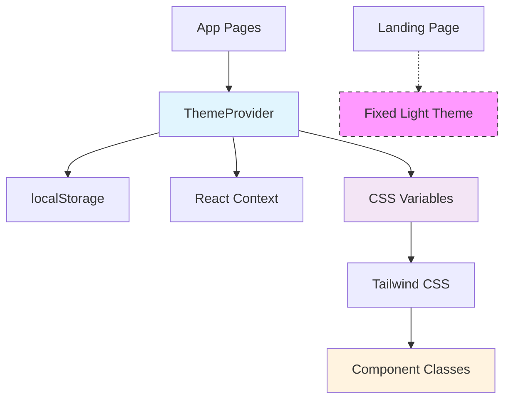
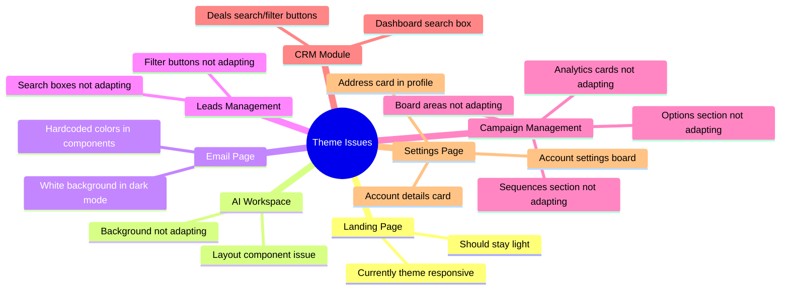
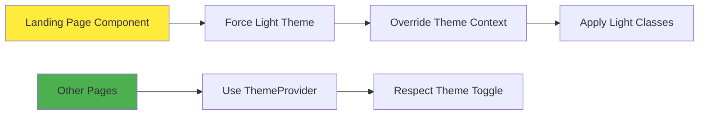
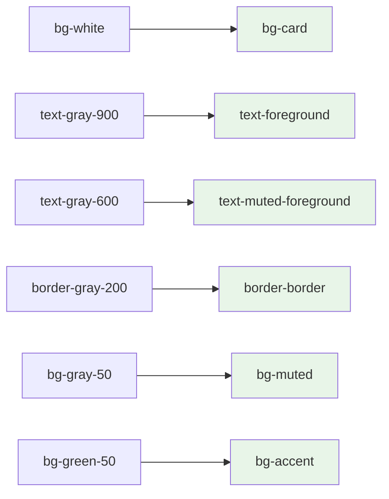

# Dark Mode Theme Fixes Design Document

## Overview

This design addresses critical dark mode adaptation issues identified across multiple pages in the Flownest application. The primary goal is to ensure consistent theme behavior throughout the application while maintaining the landing page's fixed light appearance and resolving semantic color usage problems in various components.

## Current Theme System Architecture



## Problem Analysis

### Theme System Configuration Issues

| Issue Category | Current State | Required State |
|---|---|---|
| Landing Page Theme | Responds to theme toggle | Fixed light theme |
| Default Theme | Light mode | Light mode (confirmed correct) |
| Component Colors | Mixed hardcoded/semantic | Consistent semantic colors |
| Theme Persistence | Working correctly | Maintain current behavior |

### Component-Specific Issues



## Technical Architecture

### Theme Color Classification

| Color Type | Light Theme | Dark Theme | Usage Context |
|---|---|---|---|
| Background | `bg-background` (white) | `bg-background` (dark) | Page/card backgrounds |
| Foreground | `text-foreground` (dark) | `text-foreground` (light) | Primary text |
| Card | `bg-card` | `bg-card` | Card containers |
| Muted | `bg-muted` | `bg-muted` | Secondary backgrounds |
| Border | `border-border` | `border-border` | Element borders |

### Landing Page Isolation Strategy



## Component Modifications

### 1. Landing Page Theme Isolation

**Approach**: Create a theme override wrapper for the landing page that forces light mode regardless of global theme setting.

```typescript
// Landing page wrapper implementation concept
const LandingWithFixedTheme = () => {
  return (
    <div className="light bg-white text-gray-900 min-h-screen">
      <Landing />
    </div>
  );
};
```

### 2. AI Workspace Background Fix

**Issue**: Background not adapting to theme changes
**Solution**: Replace hardcoded background colors with semantic theme variables

**Current Pattern**: `bg-gray-50` or `bg-white`
**Target Pattern**: `bg-background` or `bg-muted`

### 3. Email Page Theme Adaptation

**Issue**: Hardcoded colors in deal cards and containers
**Solution**: Systematic replacement of hardcoded colors

| Current Class | Semantic Replacement |
|---|---|
| `bg-white` | `bg-card` |
| `text-gray-900` | `text-foreground` |
| `text-gray-600` | `text-muted-foreground` |
| `border-gray-200` | `border-border` |
| `bg-green-50` | `bg-muted` (context-appropriate) |

### 4. Form Elements Theme Integration

**Components Affected**:
- Search boxes across multiple pages
- Filter buttons
- Dropdown menus
- Input fields

**Standardized Theme Classes**:
```css
/* Input elements */
.theme-input {
  @apply bg-background border-border text-foreground;
  @apply focus:border-ring focus:ring-ring;
}

/* Button elements */
.theme-button-secondary {
  @apply bg-secondary text-secondary-foreground;
  @apply hover:bg-secondary/80 border-border;
}
```

### 5. Card Components Theme Integration

**Pattern for Card Components**:
```typescript
// Standard card theming pattern
<div className="bg-card text-card-foreground border-border rounded-lg shadow-sm">
  <div className="text-foreground">Primary content</div>
  <div className="text-muted-foreground">Secondary content</div>
</div>
```

## Implementation Strategy

### Phase 1: Landing Page Isolation
1. Create theme override wrapper for landing page
2. Ensure landing page components use light theme classes
3. Test theme toggle doesn't affect landing page

### Phase 2: Page-Level Background Fixes
1. AI Workspace background adaptation
2. Email page background and container fixes
3. Verify page-level theme consistency

### Phase 3: Component-Level Form Elements
1. Search box theme integration across pages
2. Filter button theme adaptation  
3. Input field standardization

### Phase 4: Card and Board Components
1. Campaign management card fixes
2. Settings page card components
3. CRM dashboard elements

### Phase 5: Validation and Testing
1. Cross-page theme consistency verification
2. Theme toggle behavior testing
3. Landing page isolation confirmation

## Color Mapping Reference

### Hardcoded to Semantic Color Conversion



### Status Badge Color Adaptation

| Status | Light Theme | Dark Theme | Semantic Class |
|---|---|---|---|
| Active/Won | Green background | Darker green | `bg-green-100 text-green-800 dark:bg-green-900 dark:text-green-300` |
| Pending | Yellow background | Darker yellow | `bg-yellow-100 text-yellow-800 dark:bg-yellow-900 dark:text-yellow-300` |
| Failed/Lost | Red background | Darker red | `bg-red-100 text-red-800 dark:bg-red-900 dark:text-red-300` |

## Testing Requirements

### Functional Testing Scenarios

1. **Theme Toggle Testing**
   - Landing page remains light in all theme modes
   - Other pages respond correctly to theme changes
   - Theme persistence works across page navigation

2. **Component Visibility Testing**
   - All text remains readable in both themes
   - Form elements have proper contrast
   - Interactive elements are clearly distinguishable

3. **Cross-Browser Testing**
   - Theme behavior consistent across browsers
   - CSS variable support verification
   - Fallback color functionality

### Visual Regression Testing

| Page | Light Theme Check | Dark Theme Check |
|---|---|---|
| Landing | ✓ Always light | ✓ Stays light |
| AI Workspace | ✓ Proper backgrounds | ✓ Dark adaptation |
| Email | ✓ Card visibility | ✓ Dark card themes |
| Leads Management | ✓ Form elements | ✓ Dark form themes |
| Campaigns | ✓ Board visibility | ✓ Dark board themes |
| CRM | ✓ Dashboard elements | ✓ Dark dashboard |
| Settings | ✓ Card components | ✓ Dark card themes |

## Performance Considerations

### CSS Variable Optimization
- Minimize theme-related re-renders
- Efficient CSS variable usage
- Reduced specificity conflicts

### Component Re-render Strategy
- Theme changes only affect necessary components
- Proper memo usage for theme-independent components
- Optimized context provider structure

## Security and Accessibility

### Accessibility Compliance
- Maintain WCAG 2.1 AA contrast ratios
- Ensure focus indicators work in both themes
- Screen reader compatibility for theme changes

### Color Contrast Requirements
- Text contrast ratio minimum 4.5:1
- Interactive elements contrast ratio minimum 3:1
- Focus indicators clearly visible in both themes    
    G[Landing Page] -.-> H[Fixed Light Theme]
    I[App Pages] --> A
    
    style H fill:#f9f,stroke:#333,stroke-dasharray: 5 5
    style A fill:#e1f5fe
    style D fill:#f3e5f5
    style F fill:#fff3e0
```

## Problem Analysis

### Theme System Configuration Issues

| Issue Category | Current State | Required State |
|---|---|---|
| Landing Page Theme | Responds to theme toggle | Fixed light theme |
| Default Theme | Light mode | Light mode (confirmed correct) |
| Component Colors | Mixed hardcoded/semantic | Consistent semantic colors |
| Theme Persistence | Working correctly | Maintain current behavior |

### Component-Specific Issues


## Technical Architecture

### Theme Color Classification

| Color Type | Light Theme | Dark Theme | Usage Context |
|---|---|---|---|
| Background | `bg-background` (white) | `bg-background` (dark) | Page/card backgrounds |
| Foreground | `text-foreground` (dark) | `text-foreground` (light) | Primary text |
| Card | `bg-card` | `bg-card` | Card containers |
| Muted | `bg-muted` | `bg-muted` | Secondary backgrounds |
| Border | `border-border` | `border-border` | Element borders |

### Landing Page Isolation Strategy


## Component Modifications

### 1. Landing Page Theme Isolation

**Approach**: Create a theme override wrapper for the landing page that forces light mode regardless of global theme setting.

```typescript
// Landing page wrapper implementation concept
const LandingWithFixedTheme = () => {
  return (
    <div className="light bg-white text-gray-900 min-h-screen">
      <Landing />
    </div>
  );
};
```

### 2. AI Workspace Background Fix

**Issue**: Background not adapting to theme changes
**Solution**: Replace hardcoded background colors with semantic theme variables

**Current Pattern**: `bg-gray-50` or `bg-white`
**Target Pattern**: `bg-background` or `bg-muted`

### 3. Email Page Theme Adaptation

**Issue**: Hardcoded colors in deal cards and containers
**Solution**: Systematic replacement of hardcoded colors

| Current Class | Semantic Replacement |
|---|---|
| `bg-white` | `bg-card` |
| `text-gray-900` | `text-foreground` |
| `text-gray-600` | `text-muted-foreground` |
| `border-gray-200` | `border-border` |
| `bg-green-50` | `bg-muted` (context-appropriate) |

### 4. Form Elements Theme Integration

**Components Affected**:
- Search boxes across multiple pages
- Filter buttons
- Dropdown menus
- Input fields

**Standardized Theme Classes**:
```css
/* Input elements */
.theme-input {
  @apply bg-background border-border text-foreground;
  @apply focus:border-ring focus:ring-ring;
}

/* Button elements */
.theme-button-secondary {
  @apply bg-secondary text-secondary-foreground;
  @apply hover:bg-secondary/80 border-border;
}
```

### 5. Card Components Theme Integration

**Pattern for Card Components**:
```typescript
// Standard card theming pattern
<div className="bg-card text-card-foreground border-border rounded-lg shadow-sm">
  <div className="text-foreground">Primary content</div>
  <div className="text-muted-foreground">Secondary content</div>
</div>
```

## Implementation Strategy

### Phase 1: Landing Page Isolation
1. Create theme override wrapper for landing page
2. Ensure landing page components use light theme classes
3. Test theme toggle doesn't affect landing page

### Phase 2: Page-Level Background Fixes
1. AI Workspace background adaptation
2. Email page background and container fixes
3. Verify page-level theme consistency

### Phase 3: Component-Level Form Elements
1. Search box theme integration across pages
2. Filter button theme adaptation  
3. Input field standardization

### Phase 4: Card and Board Components
1. Campaign management card fixes
2. Settings page card components
3. CRM dashboard elements

### Phase 5: Validation and Testing
1. Cross-page theme consistency verification
2. Theme toggle behavior testing
3. Landing page isolation confirmation

## Color Mapping Reference

### Hardcoded to Semantic Color Conversion


### Status Badge Color Adaptation

| Status | Light Theme | Dark Theme | Semantic Class |
|---|---|---|---|
| Active/Won | Green background | Darker green | `bg-green-100 text-green-800 dark:bg-green-900 dark:text-green-300` |
| Pending | Yellow background | Darker yellow | `bg-yellow-100 text-yellow-800 dark:bg-yellow-900 dark:text-yellow-300` |
| Failed/Lost | Red background | Darker red | `bg-red-100 text-red-800 dark:bg-red-900 dark:text-red-300` |

## Testing Requirements

### Functional Testing Scenarios

1. **Theme Toggle Testing**
   - Landing page remains light in all theme modes
   - Other pages respond correctly to theme changes
   - Theme persistence works across page navigation

2. **Component Visibility Testing**
   - All text remains readable in both themes
   - Form elements have proper contrast
   - Interactive elements are clearly distinguishable

3. **Cross-Browser Testing**
   - Theme behavior consistent across browsers
   - CSS variable support verification
   - Fallback color functionality

### Visual Regression Testing

| Page | Light Theme Check | Dark Theme Check |
|---|---|---|
| Landing | ✓ Always light | ✓ Stays light |
| AI Workspace | ✓ Proper backgrounds | ✓ Dark adaptation |
| Email | ✓ Card visibility | ✓ Dark card themes |
| Leads Management | ✓ Form elements | ✓ Dark form themes |
| Campaigns | ✓ Board visibility | ✓ Dark board themes |
| CRM | ✓ Dashboard elements | ✓ Dark dashboard |
| Settings | ✓ Card components | ✓ Dark card themes |

## Performance Considerations

### CSS Variable Optimization
- Minimize theme-related re-renders
- Efficient CSS variable usage
- Reduced specificity conflicts

### Component Re-render Strategy
- Theme changes only affect necessary components
- Proper memo usage for theme-independent components
- Optimized context provider structure

## Security and Accessibility

### Accessibility Compliance
- Maintain WCAG 2.1 AA contrast ratios
- Ensure focus indicators work in both themes
- Screen reader compatibility for theme changes

### Color Contrast Requirements
- Text contrast ratio minimum 4.5:1
- Interactive elements contrast ratio minimum 3:1
- Focus indicators clearly visible in both themes


