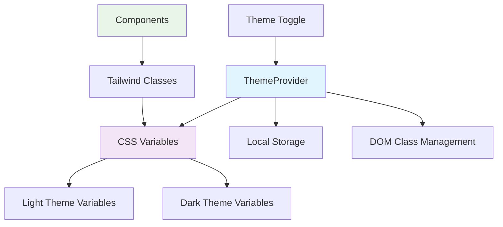
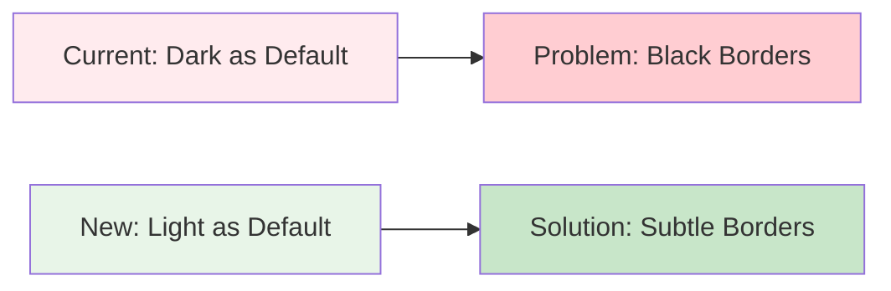
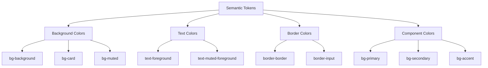

# Dark Theme Refinement Design

## Overview

This design document outlines the refinement of the dark theme implementation in the FlowNest application. The current dark theme implementation has several issues that need to be addressed:

1. **Black thick borders on cards** - Undesired visual artifacts affecting card aesthetics
2. **Inconsistent component adaptation** - Some components not properly adapting to dark mode
3. **Default theme preference** - System should default to light theme instead of system preference
4. **Incomplete coverage** - Several pages and sections missing proper dark mode support

## Architecture

### Current Theme System Analysis

The application uses a React Context-based theming system with CSS variables for color management:



### Problem Areas Identified

| Component/Page | Issue Type | Severity |
|----------------|------------|----------|
| Card Components | Thick black borders | High |
| Dashboard Sidebar | Not adapting | High |
| Campaign Analytics | Partial adaptation | Medium |
| Settings Page | Incomplete adaptation | Medium |
| CRM Deals Page | Not adapting | High |
| Page Backgrounds | Not adapting | Medium |
| Default Theme | Wrong default | Low |

## Design Solutions

### 1. Border Refinement Strategy

**Current Issue**: The `:root` CSS variables are applying dark theme styles by default, causing thick black borders on cards in light mode.

**Solution**: Restructure CSS variable definitions to provide proper light theme defaults.



**Implementation**:
- Reset `:root` variables to light theme defaults
- Ensure `.dark` class overrides provide proper dark theme styling
- Use semantic border colors: `hsl(var(--border))` instead of hardcoded values

### 2. Component Adaptation Matrix

| Component Category | Current State | Required Action |
|-------------------|---------------|-----------------|
| Dashboard Components | ❌ Not adapted | Full theming implementation |
| CRM Module | ⚠️ Partially adapted | Complete Deals page integration |
| Campaign Management | ⚠️ Analytics missing | Extend theming to all sections |
| Settings Pages | ⚠️ Incomplete | Complete theming coverage |
| Layout Components | ❌ Background issues | Fix page background adaptation |

### 3. Semantic Color System Enhancement

**Color Token Strategy**:



### 4. Default Theme Configuration

**Current**: `defaultTheme = "system"`
**New**: `defaultTheme = "light"`

**Rationale**: User preference is for light theme as default, with dark theme as an opt-in feature.

## Implementation Plan

### Phase 1: Core Theme System Fix

1. **CSS Variables Restructuring**
   - Reset `:root` to light theme defaults
   - Ensure proper contrast ratios
   - Remove thick border styling

2. **Border Styling Normalization**
   - Replace hardcoded border colors
   - Use semantic `border-border` classes
   - Ensure consistent border thickness

### Phase 2: Component Coverage Expansion

1. **Dashboard Components**
   - Sidebar background adaptation
   - Card component theming
   - Navigation element styling

2. **CRM Module Completion**
   - Deals page full adaptation
   - Table component theming
   - Form element styling

3. **Campaign Management**
   - Analytics section theming
   - Chart component adaptation
   - Status indicator styling

### Phase 3: Page Background & Layout

1. **Layout Component Updates**
   - Page background color management
   - Container theming
   - Responsive behavior maintenance

2. **Settings Page Completion**
   - Form component theming
   - Configuration panel styling
   - Toggle component adaptation

### Phase 4: Default Theme & Polish

1. **Theme Provider Update**
   - Change default to "light"
   - Maintain system preference option
   - Update documentation

2. **Quality Assurance**
   - Cross-component consistency check
   - Accessibility compliance verification
   - Performance impact assessment

## Technical Implementation Details

### CSS Variable Structure

```css
:root {
  /* Light theme as default */
  --background: 0 0% 100%;
  --foreground: 222.2 47.4% 11.2%;
  --card: 0 0% 100%;
  --card-foreground: 222.2 47.4% 11.2%;
  --border: 214.3 31.8% 91.4%; /* Subtle light border */
  --input: 214.3 31.8% 91.4%;
  /* ... other light theme variables */
}

.dark {
  /* Dark theme overrides */
  --background: 222.2 84% 4.9%;
  --foreground: 210 40% 98%;
  --card: 222.2 84% 4.9%;
  --card-foreground: 210 40% 98%;
  --border: 217.2 32.6% 17.5%; /* Subtle dark border */
  --input: 217.2 32.6% 17.5%;
  /* ... other dark theme variables */
}
```

### Component Pattern Example

```typescript
// Before: Hardcoded styling
<div className="bg-white border-2 border-black text-gray-900">

// After: Semantic theming
<div className="bg-card border border-border text-card-foreground">
```

### Theme Provider Configuration

```typescript
export function ThemeProvider({
  children,
  defaultTheme = "light", // Changed from "system"
  storageKey = "vite-ui-theme",
  ...props
}: ThemeProviderProps) {
  // Implementation remains the same
}
```

## Quality Assurance Criteria

### Visual Consistency Checklist

- [ ] All cards have consistent, subtle borders in both themes
- [ ] Background colors adapt properly across all pages
- [ ] Text contrast meets accessibility standards
- [ ] Component states (hover, focus, active) work in both themes
- [ ] No visual artifacts or styling conflicts

### Functional Requirements

- [ ] Theme toggle works correctly
- [ ] Theme preference persists across sessions
- [ ] Default theme is light mode
- [ ] System preference option remains available
- [ ] All components respond to theme changes

### Browser Compatibility

- [ ] Chrome/Chromium based browsers
- [ ] Firefox
- [ ] Safari
- [ ] Edge
- [ ] Mobile browsers (iOS Safari, Chrome Mobile)

## Risk Assessment

| Risk | Impact | Mitigation |
|------|--------|------------|
| Breaking existing themes | High | Incremental implementation with fallbacks |
| Performance degradation | Medium | CSS variable optimization |
| Accessibility issues | High | Contrast ratio validation |
| Component inconsistency | Medium | Systematic component audit |

## Success Metrics

1. **Visual Quality**: No thick black borders on any components
2. **Coverage**: 100% of components adapt to dark theme
3. **User Experience**: Smooth theme transitions without visual artifacts
4. **Default Behavior**: Application starts in light theme by default
5. **Consistency**: Uniform styling patterns across all modules

## Testing Strategy

### Manual Testing Scenarios

1. **Theme Switching**: Toggle between light and dark modes
2. **Page Navigation**: Verify consistency across all pages
3. **Component Interaction**: Test hover, focus, and active states
4. **Browser Testing**: Cross-browser compatibility validation
5. **Responsive Testing**: Mobile and desktop layout verification

### Automated Testing Considerations

- Visual regression testing for theme consistency
- Accessibility testing for contrast ratios
- Component snapshot testing for both themes
- Integration testing for theme persistence