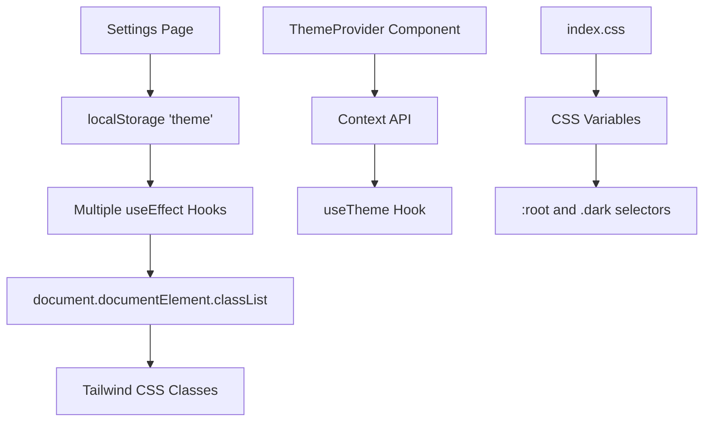
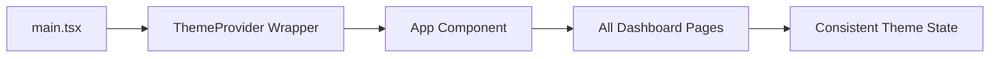

# Dashboard Theme Fix Design Document

## Overview

This document outlines the design and implementation plan for fixing theme consistency issues in the Flownest dashboard. Currently, when users select dark mode in the settings, some elements properly adapt while others remain in light mode, creating an inconsistent user experience.

## Architecture

### Current Theme Implementation

The application uses a hybrid theme implementation approach:



### Theme Architecture Issues

1. **Dual Theme Management**: The application has both a ThemeProvider component and manual localStorage + useEffect implementations
2. **Inconsistent Application**: Multiple pages manually manage theme changes using useEffect hooks
3. **Hardcoded Colors**: Many components use hardcoded color classes that don't respect dark mode
4. **Missing Dark Mode Classes**: Some UI components lack proper `dark:` variant classes

## Component Analysis

### Theme Management Components

| Component | Current State | Issues |
|-----------|---------------|---------|
| `ThemeProvider` | Available but unused | Not integrated in main app |
| `Settings.tsx` | Manual theme handling | Complex useEffect logic |
| `Layout.tsx` | Manual theme checking | Duplicated theme loading |
| `Dashboard.tsx` | Manual theme checking | Redundant implementation |

### UI Components with Theme Issues

#### High Priority (Complete Theme Failures)
- **Settings Page Forms**: Input fields use hardcoded `text-gray-900` and `bg-white/70`
- **CRM Deal Cards**: Status badges use hardcoded background colors
- **Search Components**: Input fields lack dark mode styling
- **Modal Dialogs**: Form elements don't adapt to dark theme

#### Medium Priority (Partial Theme Support)
- **Dashboard Statistics**: Some cards have dark mode, others missing variants
- **Navigation Elements**: Inconsistent hover states in dark mode
- **Table Components**: Headers and borders need dark mode improvements

### Color Mapping Strategy

Current CSS variables are properly defined but not consistently used:

```css
/* Light Theme (Default) */
:root {
  --background: 222.2 84% 4.9%;
  --foreground: 0 0% 98%;
  --card: 220 20% 10%;
  --muted: 215 20% 30%;
}

/* Dark Theme */
.dark {
  --background: 222.2 84% 4.9%;
  --foreground: 210 40% 98%;
  --card: 222.2 84% 4.9%;
  --muted: 217.2 32.6% 17.5%;
}
```

## Solution Design

### 1. Theme Provider Integration

Replace manual theme management with centralized ThemeProvider:



### 2. Component Refactoring Strategy

#### Phase 1: Core Infrastructure
- Integrate ThemeProvider in main.tsx
- Remove manual theme useEffect hooks from pages
- Update Layout component to use useTheme hook

#### Phase 2: Form Components
- Update all input fields to use semantic color classes
- Replace hardcoded colors with CSS variable-based classes
- Add dark mode variants to all form elements

#### Phase 3: UI Component Updates
- Update status badges to use theme-aware colors
- Fix table headers and borders for dark mode
- Update modal backgrounds and text colors

### 3. Color Class Standardization

Replace hardcoded color classes with semantic alternatives:

| Current Hardcoded | Semantic Replacement |
|-------------------|---------------------|
| `text-gray-900` | `text-foreground` |
| `bg-white` | `bg-background` or `bg-card` |
| `border-gray-200` | `border-border` |
| `text-gray-600` | `text-muted-foreground` |
| `bg-gray-50` | `bg-muted` |

### 4. Form Input Standardization

Create consistent form input styling:

```css
/* Standard input classes */
.form-input {
  @apply bg-background border-border text-foreground;
  @apply focus:border-ring focus:ring-ring/20;
  @apply dark:bg-card dark:border-border dark:text-foreground;
}
```

## Implementation Strategy

### Critical Components Requiring Updates

1. **Settings.tsx**
   - Remove manual theme useEffect hooks
   - Update form input classes to use semantic colors
   - Replace hardcoded gray colors with theme-aware alternatives

2. **CRM Components**
   - Update Dashboard.tsx to use semantic colors
   - Fix Deals.tsx kanban cards and table styling
   - Update Contacts.tsx and Companies.tsx forms

3. **Global Components**
   - Update Layout.tsx header and sidebar
   - Fix navigation hover states
   - Update modal dialog styling

### Color Audit Results

Components with hardcoded colors requiring immediate attention:

- **Input Fields**: 45+ instances of hardcoded input styling
- **Status Badges**: 12+ hardcoded color combinations
- **Card Components**: 30+ instances missing dark mode variants
- **Text Elements**: 60+ hardcoded text-gray-* classes

## Testing Strategy

### Theme Switching Verification
1. Toggle dark mode in Settings
2. Navigate through all dashboard pages
3. Verify consistent theming across:
   - Form inputs and labels
   - Card backgrounds and text
   - Navigation elements
   - Modal dialogs
   - Status indicators

### Cross-Browser Compatibility
- Test theme persistence across page refreshes
- Verify CSS variable support in target browsers
- Validate theme transitions and animations

### User Experience Validation
- Ensure smooth theme transitions
- Verify text readability in both themes
- Confirm color contrast meets accessibility standards

## Migration Path

### Phase 1: Infrastructure (Priority: High)
1. Integrate ThemeProvider in main application
2. Remove redundant theme management code
3. Update Layout component architecture

### Phase 2: Core Pages (Priority: High)
1. Fix Settings page form elements
2. Update Dashboard statistics and cards
3. Repair CRM component theming

### Phase 3: Polish (Priority: Medium)
1. Enhance transition animations
2. Add system theme detection
3. Improve accessibility contrast ratios

## Success Metrics

- **Consistency**: 100% of dashboard elements respond to theme changes
- **Performance**: Theme switching completes within 200ms
- **Persistence**: Theme preference maintained across sessions
- **Accessibility**: All text maintains 4.5:1 contrast ratio minimum