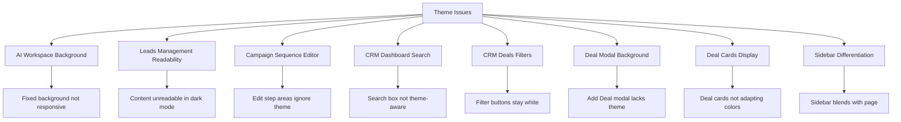
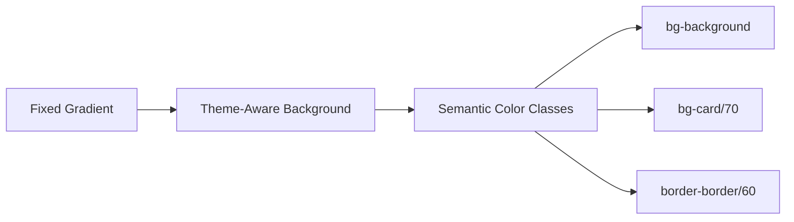
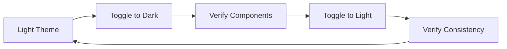

# Theme Compatibility Fix Design Document

## Overview

This design document outlines the comprehensive fix for theme compatibility issues across the Flownest application. The project currently has inconsistent theme adaptation where several components and pages do not properly respond to dark/light theme changes, affecting user experience and content readability.

## Architecture

### Current Theme System
The application uses a React-based theming system with:
- **Theme Provider**: Context-based theme management with localStorage persistence
- **CSS Variables**: HSL-based color system for both light and dark themes
- **Tailwind Integration**: Utility classes mapped to CSS variables
- **Semantic Colors**: Predefined color classes for consistent theming

### Theme Issues Identified



## Component Analysis

### 1. AI Workspace Page
**File**: `src/pages/AIWorkspace.tsx`
**Issues**:
- Page background using fixed colors instead of semantic theme variables
- Cards not properly utilizing theme-aware background colors

**Current Implementation**:
```typescript
// Current background implementation
<div className="relative rounded-2xl border bg-[radial-gradient(...)]">
```

### 2. Leads Management Page  
**File**: `src/pages/LeadsManagement.tsx`
**Issues**:
- Page background not responsive to theme changes
- Content becomes unreadable in dark mode due to color contrast issues
- Search and filter elements using hardcoded colors

### 3. Campaign Sequence Editor
**File**: `src/pages/Campaigns.tsx` (lines 1709-1773)
**Issues**:
- Edit step areas in sequences section not responding to theme changes
- Input fields and containers using fixed background colors

**Current Implementation**:
```typescript
// Problematic sequence step styling
className="w-16 px-2 py-1 text-xs border border-border rounded bg-background text-foreground focus:ring-1 focus:ring-ring"
```

### 4. CRM Dashboard Search
**File**: `src/components/CRM/Dashboard.tsx`
**Issues**:
- Search input box not adapting to theme changes
- Search results containers lacking proper theme integration

### 5. CRM Deals Page
**File**: `src/components/CRM/Deals.tsx`
**Issues**:
- Search and filter components not theme-responsive
- Filter button backgrounds remaining white in dark mode
- Add New Deal button missing background styling
- Deal modal lacking proper theme integration
- Deal cards in kanban view not adapting colors properly

### 6. Sidebar Theme Differentiation
**File**: `src/components/Layout/Sidebar.tsx`
**Issues**:
- Sidebar background color identical to page background in dark theme
- Lack of visual separation between sidebar and main content

## Theme Color Specifications

### Current Theme Variables
```css
:root {
  --background: 0 0% 100%;
  --card: 0 0% 100%;
  --muted: 210 40% 96%;
  --border: 214.3 31.8% 91.4%;
}

.dark {
  --background: 222.2 84% 4.9%;
  --card: 220 20% 10%;
  --muted: 215 20% 30%;
  --border: 215 20% 20%;
  --sidebar-background: 220 25% 12%;
}
```

### Required Sidebar Color Override
For improved visual separation in dark theme:
```css
.dark .sidebar-custom {
  background-color: #1e293b; /* Fixed hex color as requested */
}
```

## Solution Design

### 1. AI Workspace Background Fix

**Approach**: Replace fixed gradient backgrounds with theme-aware semantic colors



**Implementation Strategy**:
- Replace hardcoded gradient backgrounds with `bg-background` or `bg-card/70`
- Ensure backdrop blur effects work with theme transitions
- Use semantic border classes `border-border/60`

### 2. Leads Management Readability Enhancement

**Color Contrast Solutions**:
- Text content: `text-foreground` for primary text, `text-muted-foreground` for secondary
- Background containers: `bg-card` with `text-card-foreground`
- Interactive elements: `hover:bg-muted/80` for hover states

### 3. Campaign Sequence Editor Theme Integration

**Input Field Standardization**:
```typescript
// Standard theme-aware input classes
"bg-background text-foreground border-border focus:border-ring focus:ring-ring/20"
```

**Container Background**:
- Step containers: `bg-card border-border`
- Selected states: `bg-primary/10 border-primary/20`

### 4. CRM Search Components

**Search Input Pattern**:
```typescript
// Consistent search input styling
"bg-background text-foreground border-border placeholder-muted-foreground focus:ring-2 focus:ring-ring"
```

### 5. CRM Deals Page Fixes

**Filter Button Theme Integration**:
```typescript
// Theme-aware filter buttons
"bg-card text-card-foreground border-border hover:bg-muted"
```

**Modal Background**:
```typescript
// Modal content background
"bg-card border-border text-card-foreground"
```

**Deal Cards Color Adaptation**:
```typescript
// Kanban card styling
"bg-card border-border text-card-foreground hover:bg-muted/50"
```

### 6. Sidebar Visual Differentiation

**Custom Sidebar Theme**:
```css
.sidebar-custom-dark {
  background-color: #1e293b !important;
}
```

**Implementation**:
- Apply custom class conditionally in dark theme
- Maintain existing light theme behavior
- Ensure proper contrast for sidebar content

## Implementation Plan

### Phase 1: Core Background Fixes
1. **AI Workspace**: Replace gradient backgrounds with semantic colors
2. **Leads Management**: Fix page background and content contrast
3. **Sidebar**: Implement custom dark theme color

### Phase 2: Interactive Elements
1. **Campaign Sequence Editor**: Update input fields and containers
2. **CRM Search**: Standardize search input styling
3. **Filter Components**: Ensure button theme consistency

### Phase 3: Modal and Card Components
1. **Deal Modals**: Fix background and border theming
2. **Deal Cards**: Implement proper color adaptation
3. **Form Elements**: Standardize across all components

## Technical Requirements

### Color Class Standards
- **Primary Text**: `text-foreground`
- **Secondary Text**: `text-muted-foreground`
- **Backgrounds**: `bg-background`, `bg-card`, `bg-muted`
- **Borders**: `border-border`
- **Interactive States**: `hover:bg-muted/50`, `focus:ring-ring`

### Component Patterns

#### Search Input Pattern
```typescript
const searchInputClasses = "bg-background text-foreground border-border placeholder-muted-foreground focus:ring-2 focus:ring-ring focus:border-ring transition-colors";
```

#### Card Container Pattern
```typescript
const cardClasses = "bg-card text-card-foreground border-border shadow-sm";
```

#### Button Pattern
```typescript
const buttonClasses = "bg-card text-card-foreground border-border hover:bg-muted transition-colors";
```

### Consistency Rules
1. **No Hardcoded Colors**: All colors must use semantic CSS variables
2. **Hover States**: Must be theme-aware using muted variants
3. **Focus States**: Must use ring colors from theme
4. **Border Consistency**: Use `border-border` for all component borders

## Testing Strategy

### Theme Toggle Testing


### Component Verification Checklist
- [ ] AI Workspace background adapts properly
- [ ] Leads Management content remains readable
- [ ] Campaign sequence editor fields respond to theme
- [ ] CRM dashboard search integrates with theme
- [ ] CRM deals filters adapt colors
- [ ] Deal modal backgrounds are theme-aware
- [ ] Deal cards change colors appropriately
- [ ] Sidebar maintains visual separation

## Accessibility Considerations

### Color Contrast
- Maintain WCAG AA compliance in both themes
- Ensure text remains readable on all backgrounds
- Provide sufficient contrast for interactive elements

### Focus Indicators
- Visible focus rings in both themes
- Consistent focus behavior across components
- Keyboard navigation support maintained

## Performance Impact

### CSS Variables
- Minimal performance impact from theme switching
- Efficient DOM updates using class changes
- No re-rendering of component tree during theme changes

### Bundle Size
- No additional CSS overhead
- Reuse existing theme infrastructure
- Leverage Tailwind's utility class system

This comprehensive design ensures all theme compatibility issues are addressed while maintaining consistency with the existing design system and improving overall user experience across light and dark themes.