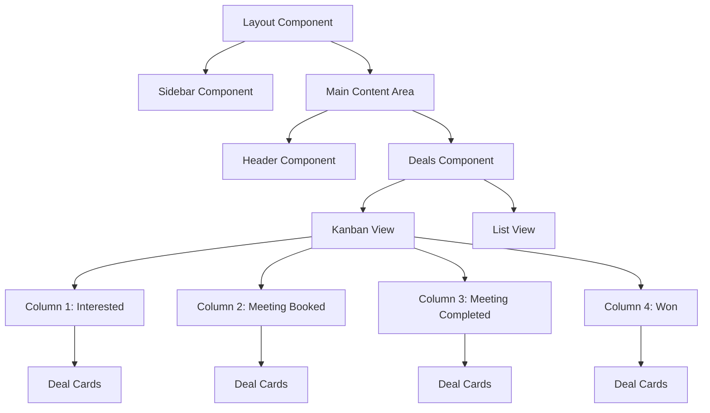
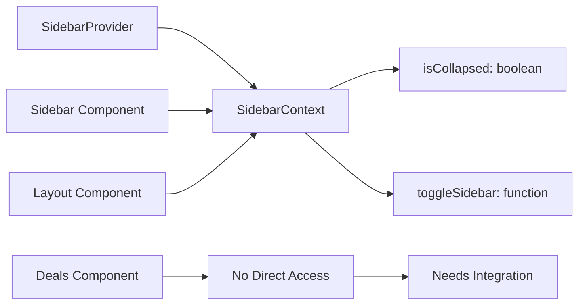
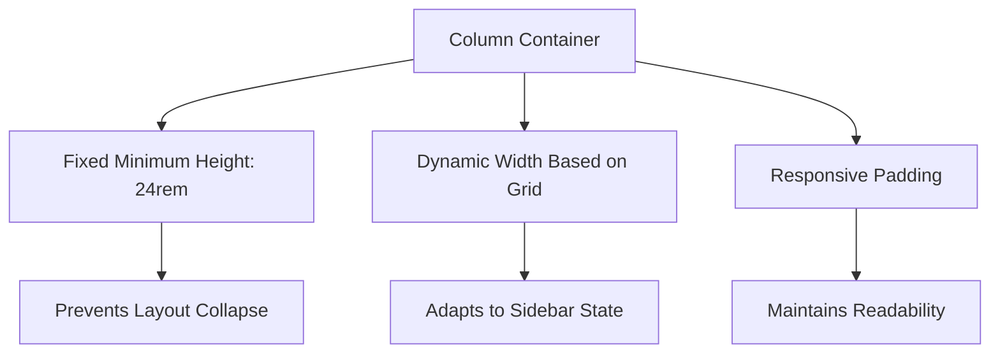
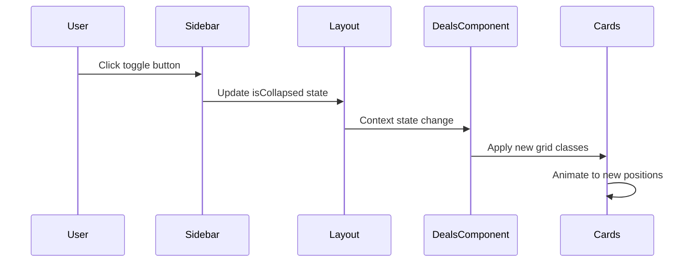

# Responsive Board Layout Design

## Overview

This design addresses the responsive layout issues in the CRM Deals kanban board where deal cards and content shift improperly when the sidebar opens/closes and do not scale correctly to accommodate changing page dimensions.

### Problem Statement

- Deal cards within the 4 kanban board columns shift unexpectedly when sidebar toggles
- Board content does not automatically scale to fit changing viewport dimensions
- Layout breaks on different screen sizes due to fixed grid configurations
- Cards overflow or get cut off when sidebar state changes

### Success Criteria

- Kanban boards maintain proper proportions when sidebar toggles
- Deal cards scale smoothly without content shifting
- Layout remains functional across all screen sizes (mobile, tablet, desktop)
- Smooth transitions during sidebar state changes

## Technology Stack & Dependencies

### Frontend Framework
- **React 18.3.1** - Component-based architecture
- **TypeScript 5.5.3** - Type safety and development experience
- **Tailwind CSS 3.4.1** - Utility-first styling framework

### State Management
- **React Context API** - Sidebar state management via `SidebarContext`
- **React Hooks** - Local component state management

### Layout System
- **CSS Grid** - Primary layout system for kanban columns
- **Flexbox** - Secondary layout for card arrangements
- **Tailwind Responsive Breakpoints** - Mobile-first responsive design

## Component Architecture

### Current Layout Structure



### Component Hierarchy and Props Flow

#### Layout Component (`src/components/Layout/Layout.tsx`)
- **Purpose**: Root layout container with sidebar state management
- **State**: Theme management, route-based styling
- **Children**: Sidebar, Header, Main content area

#### Sidebar Component (`src/components/Layout/Sidebar.tsx`)
- **Purpose**: Navigation with collapsible functionality
- **State**: Collapsed state (16px collapsed, 256px expanded)
- **Context Integration**: Uses `SidebarContext` for state management

#### Deals Component (`src/components/CRM/Deals.tsx`)
- **Purpose**: CRM deals management with kanban and list views
- **Current Grid**: Fixed 4-column grid using `grid-cols-1 md:grid-cols-2 lg:grid-cols-4`
- **Issue**: Grid doesn't respond to sidebar state changes

### State Management Pattern



## Responsive Grid System Design

### Current Grid Implementation Issues

```css
/* Current problematic implementation */
.grid {
  grid-template-columns: repeat(4, minmax(0, 1fr));
}

/* Breakpoint Issues */
grid-cols-1      /* Mobile: Single column - OK */
md:grid-cols-2   /* Tablet: Two columns - OK */
lg:grid-cols-4   /* Desktop: Four columns - Problem */
```

### Proposed Dynamic Grid System

#### Grid Configuration Matrix

| Sidebar State | Screen Size | Columns | Column Width | Gap |
|---------------|-------------|---------|-------------|-----|
| Collapsed | Mobile (< 768px) | 1 | 100% | 1rem |
| Collapsed | Tablet (768px - 1023px) | 2 | 50% | 1.5rem |
| Collapsed | Desktop (1024px - 1279px) | 4 | 25% | 1.5rem |
| Collapsed | Large (≥ 1280px) | 4 | 25% | 2rem |
| Expanded | Mobile (< 768px) | 1 | 100% | 1rem |
| Expanded | Tablet (768px - 1023px) | 2 | 50% | 1rem |
| Expanded | Desktop (1024px - 1279px) | 3 | 33.33% | 1rem |
| Expanded | Large (≥ 1280px) | 4 | 25% | 1.5rem |

#### Dynamic CSS Classes

```css
/* Sidebar Collapsed State */
.kanban-grid-collapsed {
  @apply grid gap-6;
  @apply grid-cols-1;
  @apply md:grid-cols-2;
  @apply lg:grid-cols-4;
  @apply xl:grid-cols-4;
}

/* Sidebar Expanded State */
.kanban-grid-expanded {
  @apply grid gap-4;
  @apply grid-cols-1;
  @apply md:grid-cols-2;
  @apply lg:grid-cols-3;
  @apply xl:grid-cols-4;
}
```

### Container and Card Scaling

#### Column Container Design



#### Deal Card Specifications

| Property | Mobile | Tablet | Desktop (Collapsed) | Desktop (Expanded) |
|----------|--------|--------|-------------------|-------------------|
| Min Width | 280px | 300px | 280px | 260px |
| Max Width | 100% | 100% | 100% | 100% |
| Padding | 1rem | 1rem | 1rem | 0.875rem |
| Font Size | 0.875rem | 0.875rem | 0.875rem | 0.8125rem |

## Sidebar Integration Architecture

### Context Integration Pattern

```typescript
// Hook for accessing sidebar state in Deals component
const useSidebarAware = () => {
  const { isCollapsed } = useSidebar();
  const [gridClass, setGridClass] = useState('');
  
  useEffect(() => {
    const updateGridClass = () => {
      if (isCollapsed) {
        setGridClass('kanban-grid-collapsed');
      } else {
        setGridClass('kanban-grid-expanded');
      }
    };
    
    updateGridClass();
  }, [isCollapsed]);
  
  return { gridClass, isCollapsed };
};
```

### Transition Management

#### Smooth Animation Strategy

```css
.kanban-container {
  transition: all 300ms cubic-bezier(0.4, 0, 0.2, 1);
}

.kanban-column {
  transition: width 300ms cubic-bezier(0.4, 0, 0.2, 1),
              padding 300ms cubic-bezier(0.4, 0, 0.2, 1);
}

.deal-card {
  transition: transform 200ms cubic-bezier(0.4, 0, 0.2, 1);
}
```

#### Transition Timing Coordination



## Content Overflow and Scaling Solutions

### Text and Content Adaptive Design

#### Typography Scaling Rules

```css
/* Base typography - mobile first */
.deal-title {
  @apply text-sm font-medium leading-tight;
}

.deal-meta {
  @apply text-xs;
}

/* Responsive adjustments */
@screen lg {
  .sidebar-collapsed .deal-title {
    @apply text-sm;
  }
  
  .sidebar-expanded .deal-title {
    @apply text-xs;
  }
}
```

#### Content Truncation Strategy

```typescript
// Text truncation utility
const truncateText = (text: string, maxLength: number, sidebarCollapsed: boolean) => {
  const adjustedLength = sidebarCollapsed ? maxLength : maxLength * 0.8;
  return text.length > adjustedLength 
    ? `${text.substring(0, adjustedLength)}...` 
    : text;
};
```

### Viewport-Based Scaling

#### Dynamic Font Size Calculation

```typescript
const useResponsiveFontSize = (baseSize: string, sidebarCollapsed: boolean) => {
  const [fontSize, setFontSize] = useState(baseSize);
  
  useEffect(() => {
    const calculateFontSize = () => {
      const viewportWidth = window.innerWidth;
      const sidebarWidth = sidebarCollapsed ? 64 : 256;
      const availableWidth = viewportWidth - sidebarWidth;
      
      // Scale font size based on available width
      if (availableWidth < 800) {
        setFontSize('text-xs');
      } else if (availableWidth < 1200) {
        setFontSize('text-sm');
      } else {
        setFontSize(baseSize);
      }
    };
    
    calculateFontSize();
    window.addEventListener('resize', calculateFontSize);
    
    return () => window.removeEventListener('resize', calculateFontSize);
  }, [sidebarCollapsed, baseSize]);
  
  return fontSize;
};
```

## Layout Breakpoint Strategy

### Responsive Breakpoint Matrix

| Breakpoint | Min Width | Sidebar Collapsed | Sidebar Expanded | Grid Columns | Notes |
|------------|-----------|-------------------|------------------|--------------|-------|
| Mobile | 320px | Single stack | Single stack | 1 | Minimum viable width |
| Mobile L | 480px | Single stack | Single stack | 1 | Better card proportions |
| Tablet | 768px | Two columns | Two columns | 2 | Side-by-side layout |
| Desktop S | 1024px | Four columns | Three columns | 4/3 | Primary desktop experience |
| Desktop M | 1280px | Four columns | Four columns | 4 | Optimal viewing |
| Desktop L | 1536px | Four columns | Four columns | 4 | Large screen optimization |

### Adaptive Column Width Calculations

```typescript
const calculateColumnWidth = (
  viewportWidth: number, 
  sidebarWidth: number, 
  columns: number, 
  gap: number
) => {
  const availableWidth = viewportWidth - sidebarWidth - (gap * (columns - 1));
  return Math.max(280, availableWidth / columns); // Minimum 280px per column
};
```

## Performance Optimization

### Rendering Optimization Strategy

#### Virtual Scrolling for Large Datasets

```typescript
// Virtual scrolling implementation for columns with many cards
const useVirtualizedCards = (cards: Deal[], containerHeight: number) => {
  const itemHeight = 120; // Average card height
  const visibleItems = Math.ceil(containerHeight / itemHeight) + 2; // Buffer
  
  const [scrollTop, setScrollTop] = useState(0);
  const [visibleCards, setVisibleCards] = useState<Deal[]>([]);
  
  useEffect(() => {
    const startIndex = Math.floor(scrollTop / itemHeight);
    const endIndex = Math.min(startIndex + visibleItems, cards.length);
    setVisibleCards(cards.slice(startIndex, endIndex));
  }, [scrollTop, cards, visibleItems]);
  
  return { visibleCards, setScrollTop };
};
```

#### Memoization Strategy

```typescript
// Memoized column components
const KanbanColumn = React.memo<KanbanColumnProps>(({ 
  column, 
  deals, 
  isCollapsed 
}) => {
  // Column implementation
}, (prevProps, nextProps) => {
  return prevProps.deals.length === nextProps.deals.length &&
         prevProps.isCollapsed === nextProps.isCollapsed &&
         prevProps.column.id === nextProps.column.id;
});
```

### CSS Optimization

#### Critical CSS Inlining

```css
/* Critical styles for initial render */
.kanban-container {
  display: grid;
  transition: grid-template-columns 300ms ease-in-out;
}

.kanban-column {
  min-height: 24rem;
  overflow-y: auto;
}

/* Non-critical styles loaded asynchronously */
@media (min-width: 1024px) {
  .kanban-enhanced-animations {
    /* Enhanced animations for desktop */
  }
}
```

## Testing Strategy

### Unit Testing Scope

#### Component Rendering Tests
- Kanban board renders correctly in different sidebar states
- Grid layout adjusts properly based on viewport size
- Deal cards maintain readability at all scales

#### Responsive Behavior Tests
- Sidebar toggle triggers layout recalculation
- Breakpoint transitions work smoothly
- Content overflow is handled gracefully

#### Integration Testing
- SidebarContext integration works correctly
- State changes propagate to layout components
- Performance remains acceptable during transitions

### Visual Regression Testing

#### Test Scenarios Matrix

| Test Case | Viewport | Sidebar State | Expected Outcome |
|-----------|----------|---------------|------------------|
| Mobile Portrait | 375x812 | Collapsed | Single column layout |
| Mobile Portrait | 375x812 | Expanded | Single column layout |
| Tablet Portrait | 768x1024 | Collapsed | Two column layout |
| Tablet Portrait | 768x1024 | Expanded | Two column layout |
| Desktop Small | 1024x768 | Collapsed | Four column layout |
| Desktop Small | 1024x768 | Expanded | Three column layout |
| Desktop Large | 1440x900 | Collapsed | Four column layout |
| Desktop Large | 1440x900 | Expanded | Four column layout |

### Performance Testing

#### Metrics and Benchmarks

```typescript
// Performance monitoring
const usePerformanceMonitoring = () => {
  useEffect(() => {
    const observer = new PerformanceObserver((list) => {
      list.getEntries().forEach((entry) => {
        if (entry.name === 'sidebar-toggle') {
          console.log(`Sidebar toggle duration: ${entry.duration}ms`);
        }
      });
    });
    
    observer.observe({ entryTypes: ['measure'] });
    
    return () => observer.disconnect();
  }, []);
};

// Target Benchmarks:
// - Sidebar toggle animation: < 300ms
// - Grid recalculation: < 100ms
// - Card repositioning: < 200ms
```